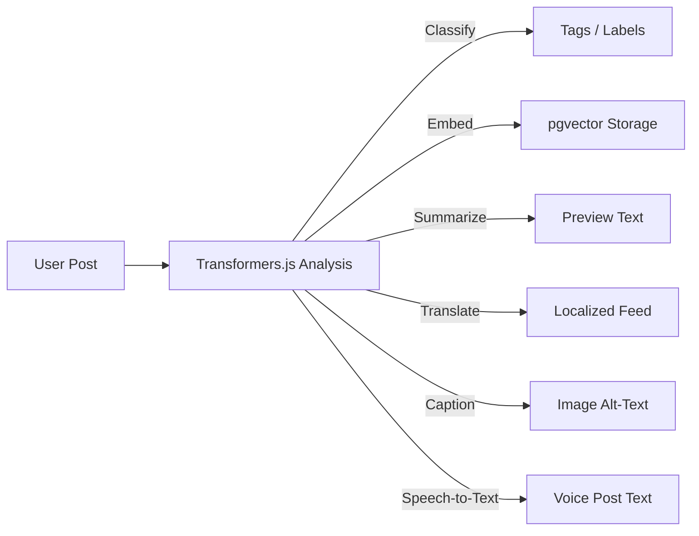

# transformerjs_activitystreams.md
## Using Transformers.js in an Activity Stream — Scenarios, Examples & Suggested Models

### 🎯 Purpose
This document explains how to integrate **Transformers.js** into a **social network–style activity stream** (e.g., Blazor + pgvector) to enrich user interactions with **local AI processing** — no cloud APIs or vendor lock-in.

The goal is to perform **text, image, and audio intelligence directly in the client**: classify posts, summarize threads, generate embeddings, caption images, and transcribe audio.

---

## 1. What is Transformers.js?

`@xenova/transformers` is a JavaScript library that brings Hugging Face models to the browser and Node.js using **WebAssembly** or **WebGPU**.  
It supports:
- Text (generation, classification, embeddings, summarization)
- Vision (classification, detection, captioning)
- Audio (speech recognition, classification)
- Multimodal (image-text embeddings like CLIP)

Models are loaded dynamically and cached in IndexedDB for offline use.

---

## 2. Why in an Activity Stream?

Your app already has streams of user content — posts, comments, media uploads, etc.  
Transformers.js lets you **analyze, enrich, and enhance** that content before it’s even uploaded.

### Benefits:
- 🧠 Client-side intelligence — no external API calls  
- 🔒 Privacy-friendly and vendor-independent  
- ⚡ Instant enrichment and feedback  
- 🌐 Works offline with cached models  

---

## 3. Example Scenarios

### 🗨️ Scenario 1 — Auto Tagging & Classification
When a user writes a post, classify its topic or sentiment locally.

```js
import { pipeline } from '@xenova/transformers';

const classifier = await pipeline('text-classification', 'distilbert-base-uncased-finetuned-sst-2-english');
const result = await classifier('I love coding with Blazor and Transformers.js!');
console.log(result);
// → [{ label: 'POSITIVE', score: 0.998 }]
```

Use case:
- Auto-tag posts (`#positive`, `#feedback`)
- Filter NSFW or spam content client-side
- Train personalized feed ranking

---

### 🧠 Scenario 2 — Local Embeddings for Search
Generate semantic embeddings for every post and store them in pgvector.

```js
const extractor = await pipeline('feature-extraction', 'sentence-transformers/all-MiniLM-L6-v2');
const embedding = await extractor(postText, { pooling: 'mean', normalize: true });
```

Use case:
- Semantic search  
- "Related posts" suggestions  
- Conversation context retrieval  

**Suggested models:**
- `sentence-transformers/all-MiniLM-L6-v2` (fast, small)
- `intfloat/e5-small-v2` (high quality)
- `BAAI/bge-small-en-v1.5` (multilingual)

---

### 📰 Scenario 3 — Post Summarization
Summarize long discussions or articles before uploading.

```js
const summarize = await pipeline('summarization', 'facebook/bart-large-cnn');
const result = await summarize(longText, { max_length: 80, min_length: 30 });
```

Use case:
- Generate automatic “post previews”
- Create digest summaries in user feeds
- Reduce noise in long threads

---

### 🌐 Scenario 4 — Translation for Multilingual Feeds
Automatically translate posts into the user’s language.

```js
const translate = await pipeline('translation', 'Helsinki-NLP/opus-mt-es-en');
const result = await translate('Hola mundo');
```

Use case:
- Multilingual communities
- “Translate” button next to each post

---

### 🖼️ Scenario 5 — Image Captioning and Classification
Generate captions for uploaded photos or classify their content.

```js
const caption = await pipeline('image-to-text', 'nlpconnect/vit-gpt2-image-captioning');
const result = await caption('/path/to/photo.jpg');
```

Use case:
- Auto-generate alt text for accessibility
- Recommend hashtags (`#sunset`, `#selfie`)
- Detect NSFW content before upload

**Suggested models:**
- `nlpconnect/vit-gpt2-image-captioning` (captioning)
- `google/vit-base-patch16-224` (classification)

---

### 🔊 Scenario 6 — Speech-to-Text for Voice Posts
Convert user voice notes into text on the client.

```js
const asr = await pipeline('automatic-speech-recognition', 'openai/whisper-tiny.en');
const result = await asr('/audio/voice.mp3');
```

Use case:
- Voice post transcription  
- Audio search index  
- Assistive accessibility features  

---

### 🧩 Scenario 7 — CLIP Embeddings for Image + Text Search
Create unified embeddings for visual and textual content.

```js
const clip = await pipeline('feature-extraction', 'openai/clip-vit-base-patch32');
```

Use case:
- “Search posts by image”
- “Find memes similar to this one”

---

## 4. Model Hosting & Offline Setup

To ensure privacy and speed:
1. Download your chosen models from Hugging Face.
2. Serve them under `/wwwroot/models` in your Blazor app.
3. Configure Transformers.js:

```js
import { env } from '@xenova/transformers';

env.localModelPath = '/models';
env.allowLocalModels = true;
env.allowRemoteModels = false;
```

Models are cached in IndexedDB after first use.

---

## 5. Suggested Model Catalog

| Task | Model | Dim | Notes |
|------|--------|-----|-------|
| Embeddings | `all-MiniLM-L6-v2` | 384 | Fast and accurate |
| Sentiment | `distilbert-sst-2` | - | Small and fast |
| Summarization | `facebook/bart-large-cnn` | - | High-quality summaries |
| Translation | `Helsinki-NLP/opus-mt-xx` | - | Language-specific pairs |
| Image Captioning | `nlpconnect/vit-gpt2-image-captioning` | - | English captions |
| Speech-to-Text | `openai/whisper-tiny` | - | Compact speech model |
| CLIP | `openai/clip-vit-base-patch32` | 512 | Vision-text embeddings |

---

## 6. Integration Example — Activity Stream Flow



---

## 7. Implementation Notes

- Use **JS Interop** to call Transformers pipelines from Blazor WASM.
- Cache embeddings in IndexedDB for faster reprocessing.
- Store model metadata (`name`, `dimension`, `version`) in your DB.
- Run heavy tasks asynchronously to avoid blocking the UI.
- Use **WebGPU** if available for massive speedups on modern browsers.

---

## 8. Future Extensions

- Personalized content ranking with embeddings  
- AI-assisted content moderation (toxicity detection)  
- Contextual reply suggestions  
- Multimodal AI chat threads combining voice + text + image  

---

**Author:** Jose Manuel Ojeda Melgar (Joche Ojeda)  
**Date:** 2025-10-31  
**Document Type:** Technical Integration Plan  
**Project Context:** Blazor-based social network activity stream using local AI inference with Transformers.js
